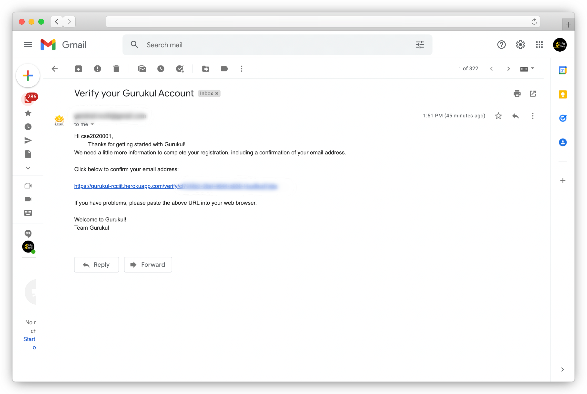
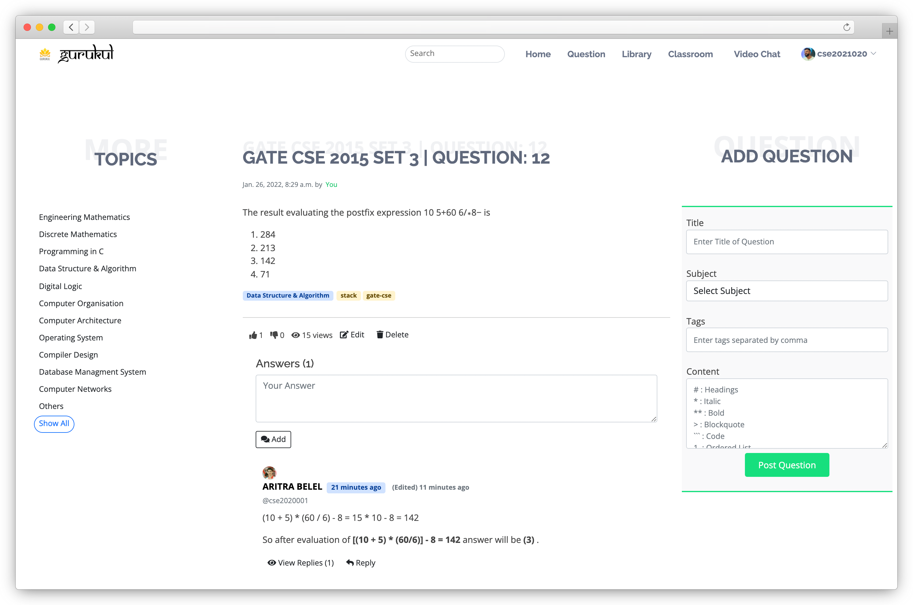
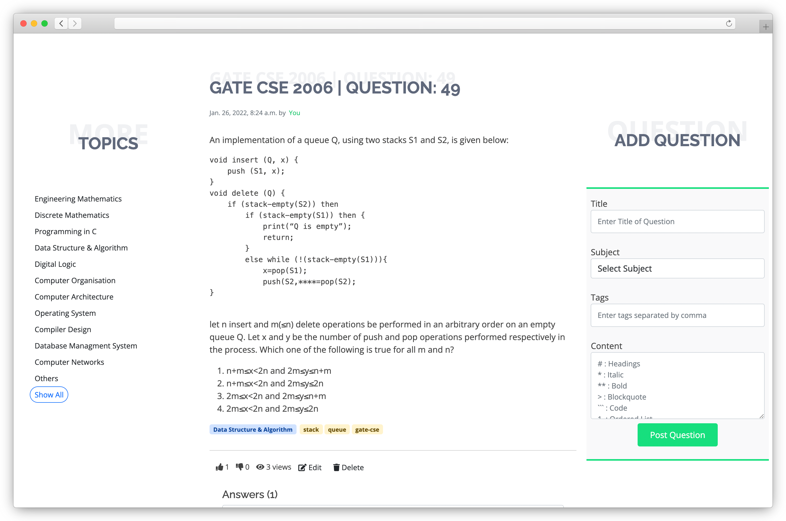
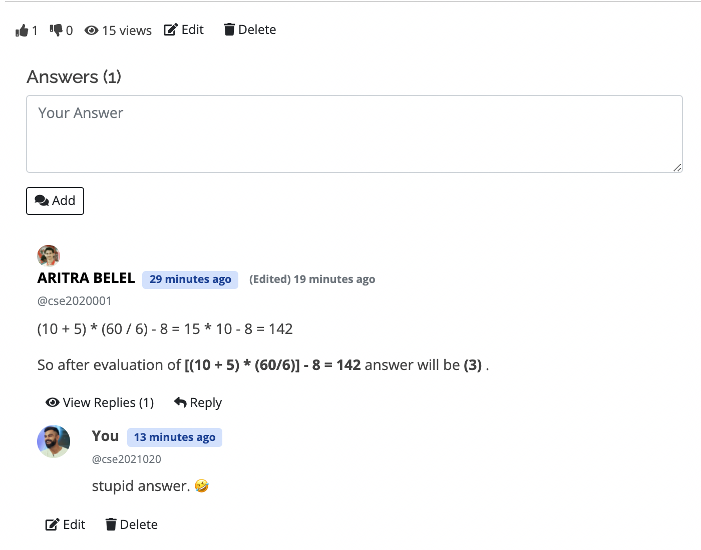
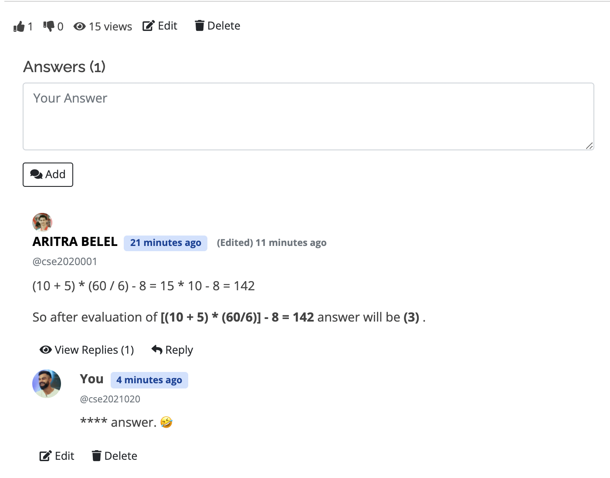

<div align="center">
    
</div>
<h1 align="center"> Gurukul </h1>
<p align="center">
    Gurukul is an online E-Learning platform for RCCIITians.
    <br />
    <a href="https://github.com/belelaritra/Gurukul"><strong>Explore the docs »</strong></a>
    <br />
    <br />
    ·
    <a href="https://gurukul-rcciit.herokuapp.com/">View Demo</a>
    ·
    <a href="https://github.com/belelaritra/Gurukul/issues">Report Bug</a>
    ·
    <a href="https://github.com/belelaritra/Gurukul/issues">Request Feature</a>
</p>

##  Tech Stack:

<div align="right">

[](https://gurukul-rcciit.herokuapp.com/)
[](https://gurukul-rcciit.herokuapp.com/)
[](https://github.com/belelaritra/Gurukul)

[](https://www.python.org/downloads/)
[](https://pypi.org/project/Django/3.2.10/)[](./LICENSE)
[](https://github.com/belelaritra/Gurukul)

</div>

<div align="center"><p>


[](https://forthebadge.com)&nbsp;&nbsp;[](https://forthebadge.com)&nbsp;&nbsp;[](https://forthebadge.com)

</p></div>

## <!-- ABOUT THE PROJECT -->

##  About The Project:

<p><a href="https://gurukul-rcciit.herokuapp.com/"></a>Gurukul</a> is an E-learning portal for RCCIITians. Where user can ask questions and get answers from the community of RCCIITians, download E-books from the Digital Library, and much more.

The project is developed by a team of four students of RCCIIT as a part of their 3rd semester python project.

#### Team members are:
<div align="center">
 &nbsp;&nbsp;<a href="https://github.com/belelaritra"><strong>Aritra Belel</strong></a>
 &nbsp;&nbsp;&nbsp;&nbsp;&nbsp;&nbsp;<a href="https://github.com/ankitmalakar7"><strong>Ankit Malakar</strong></a>
&nbsp;&nbsp;&nbsp;&nbsp;&nbsp;&nbsp;<a href="https://github.com/soham4abc"><strong>Soham Banerjee</strong></a>
&nbsp;&nbsp;&nbsp;&nbsp;&nbsp;&nbsp;<a href="https://github.com/smart-worker"><strong>Soham Sarkar</strong></a>
</div>
</p>

---

###  Clone The Project:

```
git clone https://github.com/belelaritra/Gurukul
cd Gurukul
```

### Installation:

- To install `Django` and other dependencies on your machine run this command.

```
pip install -r requirements.txt
```

### Environment Setup

Before Starting the Server

1. Create `.env` file inside root project directory.
2. Add `EMAIL` , `PASSWORD` and `SECRET_KEY` variables into `.env` file.

```
echo "EMAIL = \nPASSWORD = \nSECRET_KEY = " > .env
```

3. Give propper values to the variables & for `Password` enter the login password of your email.

> For `PASSWORD` :
>
> - Turn on [`Allow less secure apps`](https://myaccount.google.com/lesssecureapps) to <b>ON</b> from [here](https://myaccount.google.com/lesssecureapps).

> For `SECRET_KEY` :
>
> - Copy & run the following command in terminal.
>
> ```ruby
> django-admin startproject myproject
> cd myproject/myproject
> ```
>
> - Now open `settings.py` file and copy the `SECRET_KEY` value from line number `23`.
>
> ( Sample `SECRET_KEY` : `django-insecure-&)#p8aqf*r0pxv_ui2lxhxgax&@psu1@+jk9gi^vq3af0gqixi` )

### Make Migration and Migrate:

```ruby
python manage.py makemigrations
python manage.py migrate
```

### Run the server :

```ruby
python manage.py runserver
```

Now you can access the server at <a href="http://localhost:8000/">`http://localhost:8000/`</a>.

---

##  Features:

- [Account](./Account):

  - Login & Signup
  - Email Verification
  - Forgot Password
  - Update Profile Picture
  - Edit Profile & Change Password
  - 3 time login attempts
  - Safe Mode

- [Question](./Question):

  - Ask Question
  - Answer Question
  - Like & Dislike
  - Edit & Delete Question/Answer
  - Realtime Views count
  - Search Question
  - Filter Questions according to the tags
  - Sort Questions on the basis of time/views/likes/answers
  - Markdown Support
  - Profanity Filter (Forbidden words will be replaced with `*`, if safe mode is on)

- [Library](./Library):
  - Add Books
  - Preview Books
  - Download Books

This code is running live at <a href="https://gurukul-rcciit.herokuapp.com/">gurukul-rcciit.herokuapp.com</a>
<br><br>
[](https://gurukul-rcciit.herokuapp.com/)

---

##  Screenshots:

#### Email Verification:
<div align="center">

</div>

#### Question with answer:
<div align="center">

</div>

#### Question (with markdown support):
<div align="center">

</div>

#### With & without safe mode:
|Safe Mode off |Safe Mode on|
|:------------|:------------|
|||

---

##  License:

Copyright © 2022 <a href="https://gurukul-rcciit.herokuapp.com/">gurukul-rcciit.herokuapp.com</a>

The content of this repository is bound by the <a href ="https://github.com/belelaritra/Gurukul/blob/main/LICENSE">GNU GPL-3.0</a> license.

---

##  Contributors:

[](https://github.com/belelaritra/Gurukul/graphs/contributors)

<div align="center">

[](https://github.com/belelaritra/Gurukul/)

</div>